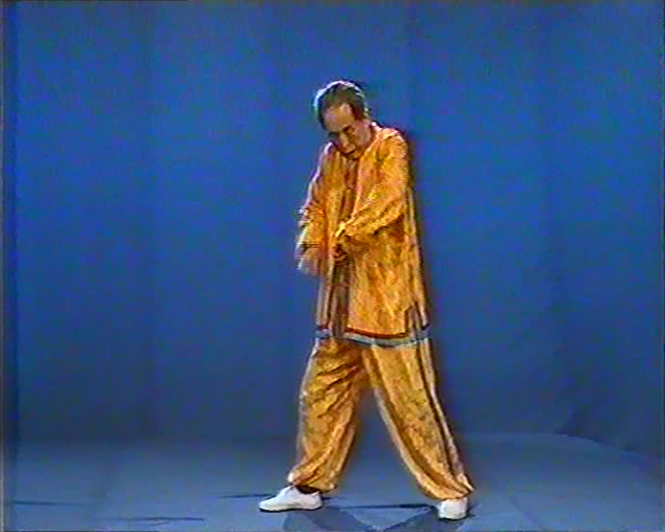
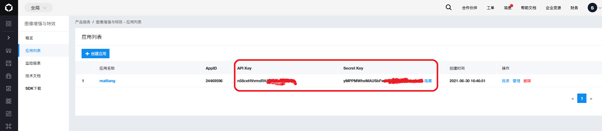

# README

这个项目是为了把老视频使用人工智能进行转换。

例如，VCD的格式： 352 x 288 ， 太小太模糊了。

感谢目前AI的发展，可以使用人工智能进行：

1. 图片无损放大
2. 图片效果增强（去噪点，提升画质）
3. 上色 等等。

具体可以参考baidu AI提供的功能（我还没有在ali上发现） https://cloud.baidu.com/doc/IMAGEPROCESS/index.html

百度图片AI增强的具体功能和收费情况：

https://cloud.baidu.com/doc/IMAGEPROCESS/s/Nk3bclmag

总之，暂且认为 每次大约1分钱吧。 批量充值就每次0.5分钱。

具体效果见：

before:

enhanced:

马礼堂养气功 VCD

TODO 修复后把内容传到B站上

## 安装

1. install ruby
2. $ gem install bundler
3. $ bundle install --verbose
4. 在baidu上注册，创建对应的应用, 记得充点儿钱.
5. 获得api key, api secret

6. 修改 config/application.rb , 填入api key, api secret

## 使用

1. get access token:

$ ruby get_access_token.rb

2. 进行对应接口的调用即可。
